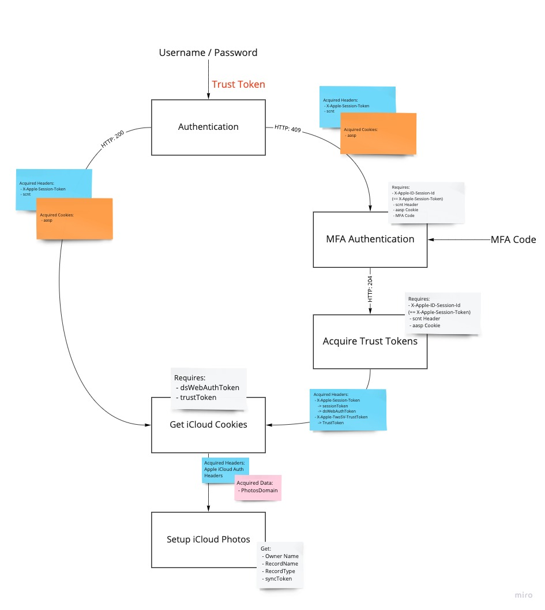

# iCloud API

This is a high level documentation of the reverse engineered iCloud API, used in this application. 

## Postman Collection

In the debugging process, a [Postman Collection](https://github.com/steilerDev/icloud-photos-sync/tree/main/docs/postman) has been created, in order to interact freely with the API.

In order to use it, `username` and `password` variables have to be set in the selected environment. Make sure that the Collection Variables are reset upon changing the environment. Also if you want to reset the current session, reset those variables and restart the authentication process

## Authentication process

This application is using the same authentication flow as icloud.com.

This research concluded in the following flow:

To execute this flow in the provided [Postman Collection](https://github.com/steilerDev/icloud-photos-sync/tree/main/postman), follow these steps:

  1. Run `01-Enter Pwd` Request
  2. If the status code is `409` an MFA code is required, if code is `200` continue to 3.
    1. To resend the MFA code to a trusted device, run `01-- Resend 2FA In-App` request
    2. To resent the MFA code to a phone through a call or sms, run `01-- Resend 2FA Phone` (you may need to adjust the body of this request)
    3. Use the `02-Enter 2FA` to provide a MFA code (by setting the `code` variable in the body), status code `204` expected
    4. Run `03-Trust Device` Request, expecting 204
  3. Acquire iCloud Cookies through `04-Setup iCloud` request
  4. Setup the Photos Library (and select either the primary or shared library through the environment variable `sharedLibrary`) through `05-Setup iCloud Photos` request
  5. *optionally (and done by the application)* Check, that the Photos Library has finished indexing with `06-Check indexing State`
  6. Now use the `iCloud Photos Library` folder, to execute actions against the iCloud Photos library

The Postman Collection expects the following Environmental variables to be defined:
  - `username` set to the iCloud username
  - `password` set to the iCloud password
  - `sharedLibrary` set to `true` in case the share library should be used