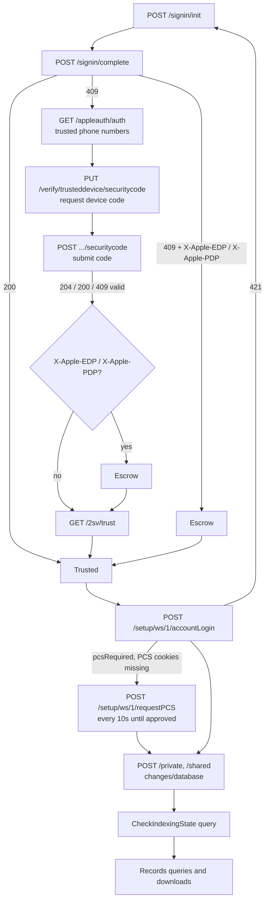

# iCloud API

This page maps the reverse engineered iCloud API surface used by this application. The application impersonates the icloud.com web client, so every request mirrors what a browser sends when signing in to icloud.com and opening Photos.

!!! info "Source of truth"
    The code is the source of truth. This page describes the API as implemented and observed in October 2026. Apple changes the API without notice, most recently with iOS 26.4 (see [Changes introduced with iOS 26.4](#changes-introduced-with-ios-264)).

| Area | Code |
|---|---|
| Endpoints, static headers, response types | `app/src/lib/resources/network-types.ts` |
| Header and cookie jar, HTTP client, network capture | `app/src/lib/resources/http-client.ts`, `app/src/lib/resources/network-manager.ts` |
| Authentication and account setup flow | `app/src/lib/icloud/icloud.ts` |
| SRP implementation | `app/src/lib/icloud/icloud.crypto.ts` |
| MFA request and submit payloads | `app/src/lib/icloud/mfa/mfa-method.ts` |
| CloudKit queries and operations | `app/src/lib/icloud/icloud-photos/icloud-photos.ts`, `query-builder.ts` |
| Record parsing | `app/src/lib/icloud/icloud-photos/query-parser.ts` |
| File type descriptors | `app/src/lib/photos-library/model/file-type.ts` |

## Overview

### Hosts

| Host | Purpose | Notes |
|---|---|---|
| `https://idmsa.apple.com/appleauth/auth` | Authentication: SRP signin, MFA, trust, escrow | The same host for all regions |
| `https://setup.icloud.com` | Account setup, PCS, logout | `setup.icloud.com.cn` for `--region china` |
| `<ckdatabasews.url>/database/1/com.apple.photos.cloud/production` | CloudKit Photos database | The host is provided by `accountLogin` (e.g. `https://p123-ckdatabasews.icloud.com:443`) |
| `*.icloud-content.com` | Asset downloads | Pre-signed URLs from the records, fetched without session headers or cookies |

### Flow


```mermaid
flowchart TD
    A[POST /signin/init] --> B[POST /signin/complete]
    B -->|200| T[Trusted]
    B -->|409 + X-Apple-EDP / X-Apple-PDP| E1[Escrow]
    B -->|409| P[GET /appleauth/auth<br/>trusted phone numbers]
    P --> R[PUT /verify/trusteddevice/securitycode<br/>request device code]
    R --> M[POST .../securitycode<br/>submit code]
    M -->|204 / 200 / 409 valid| E2{X-Apple-EDP / X-Apple-PDP?}
    E2 -->|yes| E3[Escrow]
    E2 -->|no| TR
    E3 --> TR[GET /2sv/trust]
    TR --> T
    E1 --> T
    T --> S[POST /setup/ws/1/accountLogin]
    S -->|421| A
    S -->|pcsRequired, PCS cookies missing| PCS[POST /setup/ws/1/requestPCS<br/>every 10s until approved]
    PCS --> Z
    S --> Z[POST /private, /shared<br/>changes/database]
    Z --> I[CheckIndexingState query]
    I --> Q[Records queries and downloads]
```

In the code each step emits an event that triggers the next one: `authenticate → MFA_REQUIRED → submitMFA → AUTHENTICATED → getTokens → TRUSTED → setupAccount → [PCS_REQUIRED] → ACCOUNT_READY → photos.setup → READY`.

## Common request handling

### Headers

All requests go through the header jar, which attaches headers and cookies by matching the request URL against a domain. A header or cookie applies when its domain is a substring of the request URL (or of the base URL for relative CloudKit paths).

**Sent with every request**

| Header | Value |
|---|---|
| `Accept` | `application/json` |
| `Content-Type` | `application/json` |
| `Connection` | `keep-alive` |
| `Accept-Encoding` | `gzip, deflate, br` |
| `User-Agent` | A desktop Chrome user agent (`Mozilla/5.0 (Macintosh; Intel Mac OS X 10_15_7) AppleWebKit/537.36 (KHTML, like Gecko) Chrome/130.0.0.0 Safari/537.36`) |
| `Origin` | `https://www.icloud.com` (`https://www.icloud.com.cn` for `--region china`) |

**Sent to `idmsa.apple.com` only (static)**

| Header | Value |
|---|---|
| `Origin` | `https://idmsa.apple.com` (overrides the default) |
| `Referer` | `https://idmsa.apple.com/` |
| `X-Apple-Widget-Key`, `X-Apple-OAuth-Client-Id` | The client id of the icloud.com web client (`CLIENT_ID`) |
| `X-Apple-I-FD-Client-Info` | JSON `{"U": <user agent>, "L": "en-US", "Z": "GMT+01:00", "V": "1.1", "F": ""}` |
| `X-Apple-OAuth-Response-Type` | `code` |
| `X-Apple-OAuth-Response-Mode` | `web_message` |
| `X-Apple-OAuth-Client-Type` | `firstPartyAuth` |
| `X-Apple-OAuth-Redirect-URI` | `https://www.icloud.com` |
| `X-Apple-OAuth-Require-Grant-Code` | `true` |
| `X-Apple-Offer-Security-Upgrade` | `1` |
| `X-Apple-Domain-Id` | `3` |
| `X-Apple-Frame-Id`, `X-Apple-OAuth-State` | The same random UUID, generated once per authentication flow and reset with the session |

**Captured from responses and echoed to `idmsa.apple.com`**

| Header | Captured from |
|---|---|
| `scnt` | Every successful `idmsa.apple.com` response |
| `X-Apple-Auth-Attributes` | Every successful `idmsa.apple.com` response |
| `X-Apple-ID-Session-Id` | The signin response. Older backends did not send it; the app then falls back to the value of `X-Apple-Session-Token` |

Headers and cookies are only captured from responses with an expected status code.

### Cookies

All `Set-Cookie` values are captured and sent back to every host whose URL contains the cookie's domain (e.g. `.icloud.com` cookies reach both the setup and the CloudKit host).

- A cookie without a domain is never sent.
- Expired cookies are not sent. The exception is a cookie with the magic `Expires` time of Unix `1000` (observed on `X-APPLE-WEBAUTH-HSA-LOGIN`), which is sent anyway.
- A `Set-Cookie` with an empty value removes the cookie.

| Cookie | Set by | Purpose |
|---|---|---|
| `aasp` | Signin | Tracks the authentication flow on `idmsa.apple.com` |
| `X-APPLE-WEBAUTH-TOKEN` | `accountLogin` | The web session. Missing if the account requires an action on icloud.com (see [accountLogin](#accountlogin)) |
| `X-APPLE-WEBAUTH-REPAIR` | `accountLogin` | Provided instead of `X-APPLE-WEBAUTH-TOKEN` for accounts that require an action on icloud.com |
| `X-APPLE-WEBAUTH-PCS-Photos`, `X-APPLE-WEBAUTH-PCS-Sharing` | `accountLogin` or `requestPCS` | Required for Advanced Data Protection accounts (see [requestPCS](#requestpcs)) |
| Other `X-APPLE-WEBAUTH-*` / `X-APPLE-*` | `accountLogin` | Session state, echoed as is |

### Session token

The `X-Apple-Session-Token` response header carries the session secret. It is sent later as `dsWebAuthToken` in [accountLogin](#accountlogin). The following responses provide or update it:

| Response | Header |
|---|---|
| Signin (`200` or `409`) | Always |
| MFA code submission (`409`) | When the code was valid (since iOS 26.4) |
| `/escrow/complete` | Usually |
| `/2sv/trust` | Always, together with the trust token |

### Rate limiting and retries

- All metadata requests (auth, setup and CloudKit) go through one queue, limited by `--metadata-rate`.
- Downloads use a separate queue, limited by `--download-threads` and `--download-timeout`.
- There are no HTTP-level retries, except for [throttled CloudKit requests](#errors-and-throttling). Other failures are retried by the sync engine, which reconnects (`accountLogin`) before every retry.

## Authentication

All paths are relative to `https://idmsa.apple.com/appleauth/auth`.

### Signin

The application signs in using Apple's SRP-6a variant ("GSA"), the same way as the icloud.com web client. The password never leaves the client.

**1. `POST /signin/init`**

```json
{"a": "<base64 client public value A>", "accountName": "<Apple ID>", "protocols": ["s2k", "s2k_fo"]}
```

Response (`200`):

```json
{"iteration": <n>, "salt": "<base64>", "protocol": "s2k" | "s2k_fo", "b": "<base64 server public value B>", "c": "<opaque session id>"}
```

**2. `POST /signin/complete?isRememberMeEnabled=true`**

```json
{"accountName": "<Apple ID>", "trustTokens": ["<trust token>"], "m1": "<base64>", "m2": "<base64>", "c": "<echoed from init>"}
```

The trust token from a previous MFA is sent in `trustTokens`. A missing or expired token leads to MFA.

`--legacy-login` replaces both steps with `POST /signin?isRememberMeEnabled=true` and `{"accountName", "password", "trustTokens"}`, sending the plain text password.

**Response**

| Status | Meaning | Next step |
|---|---|---|
| `200` | The trust token was accepted | [accountLogin](#accountlogin) |
| `409` with `X-Apple-EDP` or `X-Apple-PDP` | The trust token was accepted, but a second password proof is required | [Escrow](#escrow), then [accountLogin](#accountlogin) |
| `409` without those headers (usually with `X-Apple-TwoSV-Trust-Eligible`) | MFA is required | [MFA](#mfa) |
| `401` | Wrong password | `AUTH_UNAUTHORIZED` |
| `403` | Unknown Apple ID | `AUTH_FORBIDDEN` |
| `412` | Precondition failed | `AUTH_PRECONDITION_FAILED` |

The body is `{"authType": "hsa2"}`. The relevant data is in the headers: `X-Apple-Session-Token`, `X-Apple-ID-Session-Id`, `X-Apple-ID-Account-Country` (used in [accountLogin](#accountlogin)), `scnt` and the `aasp` cookie.

**SRP details** (mirroring Apple's `webSRPClientWorker.js`)

- Group: the 2048-bit group from RFC 5054, `g = 2`, hash `H = SHA-256`. `pad()` left-pads a value with zero bytes to the 256-byte length of `N`.
- Password derivation:
    - `p = SHA-256(password)`. For `s2k_fo` the lower-case hex string of that hash is used instead of the raw bytes.
    - `derived = PBKDF2-SHA-256(p, base64decode(salt), iteration, 32 bytes)`.
- Values:
    - `A = g^a mod N`, sent as base64 of `pad(A)`.
    - `u = H(pad(A) | pad(B))` and `k = H(N | pad(g))`.
    - `x = H(salt | H(":" | derived))`. Unlike textbook SRP, the account name is not part of `x`.
    - `S = (B - k * g^x)^(a + u * x) mod N` and session key `K = H(pad(S))`.
- Proofs:
    - `M1 = H((H(N) xor H(pad(g))) | H(lowercase(accountName)) | salt | pad(A) | B | K)`, where `B` is used exactly as received (not padded).
    - `M2 = H(pad(A) | M1 | K)`.
- Pitfalls found while replacing the previous SRP library: `A`, `B` and `S` must be padded where shown (otherwise roughly 1.5% of logins fail with "wrong password"), and the account name must be lower-cased in `H(I)` while it is sent as entered.

### MFA

**Trusted phone numbers: `GET /appleauth/auth`** (with `Accept: application/json`)

The backend returns either JSON, or the HTML of the sign-in frontend with a `<script class="boot_args">` JSON block. The list of phone numbers is found at one of:

- `trustedPhoneNumbers` (top level)
- `phoneNumberVerification.trustedPhoneNumbers`
- `direct.twoSV.bridgeInitiateData.phoneNumberVerification.trustedPhoneNumbers` (inside `boot_args`, since iOS 26.4)

Each phone number provides `id`, `numberWithDialCode`, and optionally `pushMode` (`sms` or `voice`), `obfuscatedNumber`, `lastTwoDigits` and `nonFTEU`. If the request fails, the application continues without phone numbers.

**Requesting a code**

| Method | Request | Body | Success |
|---|---|---|---|
| Trusted device | `PUT /verify/trusteddevice/securitycode` | none | `202` (sometimes `200`) |
| SMS / voice | `PUT /verify/phone` | `{"phoneNumber": {"id": 2, "nonFTEU": true}, "mode": "sms" \| "voice"}` | `200` |

- Since iOS 26.4 the code is no longer pushed to trusted devices after the signin `409`. The application requests the device code explicitly right after signin.
- `nonFTEU` is only sent if the backend provided it for that number.
- The device response usually has no body. If present, it holds `trustedDeviceCount`, `securityCode` (`length`, `tooManyCodesSent`, `tooManyCodesValidated`, `securityCodeLocked`, `securityCodeCooldown`) and `phoneNumberVerification`.
- The phone response holds `trustedPhoneNumber` (the number used), and optionally `trustedPhoneNumbers` and `securityCode`.

**Submitting a code**

| Method | Request | Body | Success |
|---|---|---|---|
| Trusted device | `POST /verify/trusteddevice/securitycode` | `{"securityCode": {"code": "123456"}}` | `204`, or `409` (see below) |
| SMS / voice | `POST /verify/phone/securitycode` | `{"securityCode": {"code": "123456"}, "phoneNumber": {"id": 2, "nonFTEU": true}, "mode": "sms" \| "voice"}` | `200`, or `409` (see below) |

- Since iOS 26.4 a valid code is acknowledged with `409`. The code counts as valid if the body has `securityCode.valid: true` or the response carries a new `X-Apple-Session-Token`.
- A `409` without either, a `400`, or a `service_errors` entry with code `-21669` means the code was rejected. The `service_errors[].message` values are shown to the user.
- If the `409` carries `X-Apple-EDP` or `X-Apple-PDP`, [escrow](#escrow) follows before trusting the session.

!!! note "Security keys"
    Accounts using FIDO security keys are not supported. The web client submits them via `POST /verify/security/key` with `{challenge, clientData, signatureData, authenticatorData, userHandle, credentialID, rpId: "apple.com"}`.

### Trust

**`GET /2sv/trust`** returns `204` with:

- `X-Apple-TwoSV-Trust-Token`: the trust token, persisted in the `.icloud-photos-sync` file and sent with every future signin.
- `X-Apple-Session-Token`: the updated session token.

This only happens after a fresh MFA. Observed behaviour of trust tokens:

- They expire after roughly 30 days. An expired token makes signin respond with "MFA required".
- They are bound to the IP address they were acquired from. Used from another network, they are rejected just like an expired token.
- Several tokens can co-exist for the same account. Acquiring a new one does not invalidate the others.

### Escrow

Since iOS 26.4 the backend may require a second SRP password proof, signalled by `X-Apple-EDP` or `X-Apple-PDP` on a `409`. It happens after a validated MFA code, and when signing in with a valid trust token (which otherwise looks like "MFA required").

1. `POST /escrow/init` with `{"a": "<base64 A>", "accountName": "", "protocols": ["s2k", "s2k_fo"]}`. The response has the same format as `/signin/init`.
2. `POST /escrow/complete` with `{"m1", "m2", "c", "k"}`. The proofs are calculated with an **empty account name**, `c` is echoed from the init response, and `k` is the base64 encoded SRP session key `K`.

The completion response usually carries an updated `X-Apple-Session-Token`.

## Account setup

All paths are relative to `https://setup.icloud.com` (`setup.icloud.com.cn` for `--region china`).

### accountLogin

**`POST /setup/ws/1/accountLogin`**

```json
{"dsWebAuthToken": "<session token>", "accountCountryCode": "<X-Apple-ID-Account-Country>", "extended_login": true, "trustToken": "<trust token>"}
```

The response sets the iCloud web session cookies and provides, among many other fields:

```json
{
  "dsInfo": {"isWebAccessAllowed": true},
  "isRepairNeeded": false,
  "termsUpdateNeeded": false,
  "webservices": {
    "ckdatabasews": {"url": "https://p123-ckdatabasews.icloud.com:443", "pcsRequired": true, "status": "active"}
  }
}
```

- `webservices.ckdatabasews.url` is the base of all [CloudKit](#cloudkit-photos) requests.
- `isWebAccessAllowed` must be `true` and `ckdatabasews.status` must be `active`, otherwise the account can't be used.
- **`421`** means the session token expired. The application starts over with [signin](#signin).
- **Account requires an action on icloud.com** (e.g. accepting updated terms): the response sets `isRepairNeeded` or `termsUpdateNeeded`, or only provides `X-APPLE-WEBAUTH-REPAIR` instead of `X-APPLE-WEBAUTH-TOKEN`. All further requests fail (e.g. `requestPCS` with `500` and `Missing X-APPLE-WEBAUTH-TOKEN cookie`), so the application aborts with `AUTH_ACCOUNT_SETUP_INCOMPLETE`.
- If `pcsRequired` is set and the `X-APPLE-WEBAUTH-PCS-Photos` and `X-APPLE-WEBAUTH-PCS-Sharing` cookies were not provided, [requestPCS](#requestpcs) follows.

### requestPCS

Accounts with Advanced Data Protection (ADP) need PCS cookies to read the Photos database. The user has to approve the request on a trusted device.

**`POST /setup/ws/1/requestPCS`** with `{"appName": "photos", "derivedFromUserAction": true}` returns:

```json
{"isWebAccessAllowed": true, "status": "success" | "failure", "message": "<description>"}
```

- `failure` means the request was not approved yet. The application repeats the request every 10 seconds.
- `success` sets both PCS cookies. A success without both cookies is an error (`AUTH_PCS_COOKIE_MISSING`).
- Observed: on an ADP account the request confirmed on its own after one or two retries.
- Observed: after many sign-ins in a short time, the request failed with `500` and `{"isDeviceConsentedForPCS": false, "message": "Issue requesting IDMS for arming."}`. Apple could not send the consent prompt, and waiting 5 minutes did not clear it.

Once the PCS cookies are set, `ENCRYPTED_BYTES` record fields (e.g. `filenameEnc`) arrive readable, just like on accounts without ADP.

### logout

**`POST /setup/ws/1/logout`** with `{"trustBrowser": true, "allBrowsers": false}` returns `200`, or `421` if the session already expired. The trust token stays valid.

## CloudKit Photos

All paths are relative to `<ckdatabasews.url>/database/1/com.apple.photos.cloud/production`, followed by an area:

- `/private`: zones owned by the user.
- `/shared`: zones shared with the user by someone else.

The cookies from [accountLogin](#accountlogin) authenticate these requests; no additional headers are needed.

### Zones

**`POST /{private|shared}/changes/database`** with `{}`, sent for both areas:

```json
{
  "moreComing": false,
  "syncToken": "<token>",
  "zones": [
    {"zoneID": {"zoneName": "PrimarySync", "ownerRecordName": "<owner id>", "zoneType": "REGULAR_CUSTOM_ZONE"}, "deleted": false}
  ]
}
```

- `PrimarySync` in the private area is the user's library. It is required.
- `SharedSync-<id>` is the iCloud Shared Photo Library. It is in the private area if the user owns it, and in the shared area if the user participates in someone else's.
- Zones flagged as `deleted` are ignored. `syncToken` is not used.

Every records request names its zone with `{"zoneName", "zoneType", "ownerRecordName"}`, taken from this response.

### Records query

**`POST /{area}/records/query?remapEnums=True`**

```json
{
  "query": {
    "recordType": "CPLAssetAndMasterByAssetDateWithoutHiddenOrDeleted",
    "filterBy": [
      {"fieldName": "startRank", "comparator": "EQUALS", "fieldValue": {"value": 0, "type": "INT64"}},
      {"fieldName": "direction", "comparator": "EQUALS", "fieldValue": {"value": "ASCENDING", "type": "STRING"}}
    ]
  },
  "zoneID": {"zoneName": "PrimarySync", "zoneType": "REGULAR_CUSTOM_ZONE", "ownerRecordName": "<owner id>"},
  "desiredKeys": ["recordName", "resOriginalRes", "..."],
  "resultsLimit": 198,
  "continuationMarker": "<from previous page, optional>"
}
```

Response:

```json
{"records": [ ... ], "continuationMarker": "<present if more results are available>"}
```

Each record looks like this:

```json
{
  "recordName": "<id>",
  "recordType": "CPLAsset",
  "fields": {"<field>": {"value": ..., "type": "..."}},
  "modified": {"timestamp": 1660139199099},
  "zoneID": {"zoneName": "PrimarySync", ...},
  "deleted": false
}
```

`modified.timestamp` is in milliseconds. Record responses are not schema validated; `query-parser.ts` parses the fields it needs defensively.

**Filters used**

| `fieldName` | `comparator` | `type` | Purpose |
|---|---|---|---|
| `startRank` | `EQUALS` | `INT64` | Position to start at |
| `direction` | `EQUALS` | `STRING` | Always `ASCENDING` |
| `parentId` | `EQUALS` | `STRING` | Record name of the album or folder |
| `indexCountID` | `IN` | `STRING_LIST` | The index to count (see below) |

**Query record types**

| `recordType` | Filters | Returns |
|---|---|---|
| `CheckIndexingState` | none | One record with `state` (`RUNNING` or `FINISHED`) and, while running, `progress` |
| `HyperionIndexCountLookup` | `indexCountID` | One record with `itemCount` |
| `CPLAssetAndMasterByAssetDateWithoutHiddenOrDeleted` | `startRank`, `direction` | "All photos": a `CPLAsset` and a `CPLMaster` per position |
| `CPLAssetAndMasterHiddenByAssetDate` | `startRank`, `direction` | Hidden photos: a `CPLAsset` and a `CPLMaster` per position |
| `CPLContainerRelationLiveByPosition` | `startRank`, `direction`, `parentId` | Album contents: a `CPLAsset`, a `CPLMaster` and a `CPLContainerRelation` per position |
| `CPLAlbumByPositionLive` | `parentId` (omitted for the top level) | `CPLAlbum` records of one folder level |

**Index count IDs** (`HyperionIndexCountLookup`)

| `indexCountID` | Counts |
|---|---|
| `CPLAssetByAssetDateWithoutHiddenOrDeleted` | All photos |
| `CPLAssetHiddenByAssetDate` | Hidden photos |
| `CPLContainerRelationNotDeletedByAssetDate:<album record name>` | Photos of one album |

### Indexing state

Before a sync, a `CheckIndexingState` query runs against the primary zone and, if available, the shared library zone. The sync only starts if every zone reports `FINISHED`. While Apple is indexing (e.g. after enabling iCloud Photos), the state is `RUNNING`.

### Pagination

The application requests 198 records per page (`resultsLimit`), and the limit counts records, not positions. A position in "All photos" returns two records (asset and master), a position in an album three (asset, master and container relation). The application therefore fetches assets as follows:

1. Count the expected positions with `HyperionIndexCountLookup`.
2. Split them into ranges of 99 positions (all photos, hidden photos) or 66 positions (albums), and query all ranges in parallel using `startRank`.
3. If a range returns fewer positions than expected, follow the `continuationMarker`. A marker is only valid together with the query it was returned for, so the original `startRank` is kept. Without a marker, query again starting at the first missing position.
4. Count received positions by the number of `CPLAsset` records. iCloud does not always return a master for every asset (observed: 99 assets but 98 masters in one page).
5. De-duplicate records by `recordType` and `recordName`, since ranges may overlap.

If the final number of assets or masters does not match the count, a `COUNT_MISMATCH` warning is emitted.

Album listings (`CPLAlbumByPositionLive`) are paged by following the `continuationMarker` until none is returned. Before that was implemented, a folder listing was capped at 200 albums.

### Albums and folders

Albums are only read from the primary zone. The tree is walked breadth-first: the top level is queried without `parentId`, then every folder's children with `parentId` set to the folder's record name.

`CPLAlbum` fields:

| Field | Content |
|---|---|
| `albumType` | `0` album, `3` folder. Records with other values are ignored |
| `albumNameEnc` | Base64 encoded UTF-8 album name |
| `parentId` | Record name of the parent folder, missing on the top level |

- The records `----Root-Folder----` and `----Project-Root-Folder----` are internal and skipped, as are records flagged as `deleted`.
- An album's assets are fetched with `CPLContainerRelationLiveByPosition` and `parentId` set to the album's record name.
- Album queries run against the primary zone only, so shared library assets are not returned for albums.
- Hidden photos are not part of the album tree. With `--sync-hidden` the application adds a synthetic "Hidden" album from the hidden photos queries.

### Asset records

A photo or video consists of two records:

- **`CPLMaster`**: the original file as imported.
- **`CPLAsset`**: the library entry, holding user state (favorite, hidden, deleted) and the edited version, if any. It points to its master through `masterRef`.

**Desired keys** requested in asset queries: `recordName`, `resOriginalRes`, `resOriginalFileType`, `resJPEGFullRes`, `resJPEGFullFileType`, `resVidFullRes`, `resVidFullFileType`, `filenameEnc`, `isDeleted`, `isFavorite`, `isHidden`, `masterRef`, `adjustmentType`.

| Record | Field | Content |
|---|---|---|
| `CPLMaster` | `resOriginalRes` | The original file (an [asset resource](#asset-resources)) |
| | `resOriginalFileType` | File type descriptor of the original, e.g. `public.heic` |
| | `filenameEnc` | Base64 encoded original file name (type `ENCRYPTED_BYTES`) |
| `CPLAsset` | `masterRef` | Reference to the master; `value.recordName` is the master's record name |
| | `isFavorite` | `1` for favorites |
| | `isHidden` | `1` for hidden assets |
| | `isDeleted` | `1` for assets in "Recently Deleted" |
| | `adjustmentType` | Set if the asset was edited, e.g. `com.apple.photo`. `com.apple.video.slomo` marks a slow-motion video, which has no rendered resource |
| | `resJPEGFullRes`, `resJPEGFullFileType` | The edited version of a photo |
| | `resVidFullRes`, `resVidFullFileType` | The edited version of a video |

- **A master's `recordName` equals the `fileChecksum` of its `resOriginalRes`** (observed for all 202 masters of the test library).
- The application downloads the original from the master, and if `adjustmentType` is set, the edited version from the asset (`resJPEGFullRes`, falling back to `resVidFullRes`).
- The modification time of the original comes from the master's `modified` timestamp, the one of the edited version from the asset's.
- File type descriptors are Uniform Type Identifiers. `file-type.ts` maps the known ones to file extensions; unknown ones are reported through crash reporting so support can be added.

**Fields observed but not used**

- `resOriginalVidComplRes` and `resOriginalVidComplFileType` on `CPLMaster`: the video part of a Live Photo (always `com.apple.quicktime-movie`).
- `mediaMetaDataEnc` on `CPLMaster`: a base64 encoded binary property list (`bplist00`) holding Exif and TIFF metadata (camera model, exposure, dimensions, capture time, …).
- `timeZoneNameEnc` (type `ENCRYPTED_BYTES`).

### Asset resources

Resource fields (e.g. `resOriginalRes`) have the type `ASSETID`:

```json
{
  "type": "ASSETID",
  "value": {
    "fileChecksum": "ARN5w7b2LvDDhsZ8DnbU3RuZeShX",
    "referenceChecksum": "AS/OBaLJzK8dRs8QM97ikJQfJEGI",
    "size": 170384,
    "wrappingKey": "NQtpvztdVKKNfrb8lf482g==",
    "downloadURL": "https://cvws-h2.icloud-content.com/...${f}...&e=<expiry>"
  }
}
```

See [Asset downloads](#asset-downloads) for `downloadURL` and [File checksum](#file-checksum) for `fileChecksum`. The downloaded content is the plain file; `wrappingKey` is not needed to read it.

### Hidden photos and the shared library

- **Hidden photos** are excluded from "All photos" and counted separately. With `--sync-hidden` the application queries `CPLAssetAndMasterHiddenByAssetDate` (counted via `CPLAssetHiddenByAssetDate`) in the primary and the shared library zone. Albums do contain hidden assets (with `isHidden: 1`), and their masters; without `--sync-hidden` both are removed from album results.
- **Shared library**: "All photos" and hidden photos are queried in the `SharedSync-*` zone as well, in the area the zone was found in.

### Modify records

**`POST /private/records/modify?remapEnums=True`**, used by `archive --remote-delete` to move assets to "Recently Deleted":

```json
{
  "operations": [
    {
      "operationType": "update",
      "record": {"recordName": "<CPLAsset record name>", "recordType": "CPLAsset", "recordChangeTag": "21h2", "fields": {"isDeleted": {"value": 1}}}
    }
  ],
  "zoneID": {"zoneName": "PrimarySync", "zoneType": "REGULAR_CUSTOM_ZONE", "ownerRecordName": "<owner id>"},
  "atomic": true
}
```

- The response holds the updated `records`.
- The application only deletes assets of the primary zone, and never favorites.
- `recordChangeTag` is a fixed value, which the backend accepts.

### Errors and throttling

Rejected CloudKit requests return a JSON body:

```json
{"serverErrorCode": "THROTTLED", "reason": "<description>", "retryAfter": 30}
```

- Too many requests are answered with `503` and `serverErrorCode` `THROTTLED` or `TRY_AGAIN_LATER`, or with `429`. The wait time is in `retryAfter` (seconds) or the `Retry-After` header.
- The application then pauses all CloudKit requests for the requested time (10 seconds if none is given, at most 5 minutes) and retries up to 10 times.
- Other errors are wrapped in `ICLOUD_PHOTOS_REQUEST_FAILED`, including status, `serverErrorCode`, `reason` and `retryAfter` (or the start of a non-JSON body).

## Asset downloads

Asset records (`CPLMaster` and `CPLAsset`) reference their files through resource fields (e.g. `resOriginalRes` for the original, `resJPEGFullRes` or `resVidFullRes` for the edited version). Each resource provides `size`, `fileChecksum`, `referenceChecksum`, `wrappingKey` and `downloadURL`.

### Download URLs

The `downloadURL` is a pre-signed URL on an `icloud-content.com` host (observed: `cvws-h2.icloud-content.com`). It is requested as provided (including the literal `${f}` placeholder in its path) with a plain `GET`, without any headers or cookies.

  - **Expiry**: The query parameter `e` holds the expiry time as Unix timestamp (seconds). All download URLs of a records query expire **15 minutes** after the query was executed (observed in October 2026).
  - **Expired URLs**: A request to an expired URL is answered with status `410 Gone`. The session itself is not affected, but all URLs of the same query have expired as well.

Large libraries can therefore not be downloaded with a single records fetch. The application treats a `410` response as a signal to refetch the remote state and continue with the remaining assets. As long as assets were written since the previous fetch, this does not count towards the maximum number of retries.

### File checksum

The `fileChecksum` is a base64 encoded, 21 byte signature of the file content:

  - **Byte 0**: Signature type. All observed checksums use type `0x01`.
  - **Bytes 1-20**: SHA-1 hash over the static salt `com.apple.XattrObjectSalt\0com.apple.DataObjectSalt\0` (`\0` being a null byte), followed by the file content.

```js
import crypto from 'crypto';

const SALT = Buffer.from(`com.apple.XattrObjectSalt\0com.apple.DataObjectSalt\0`);
const signature = Buffer.concat([
    Buffer.from([0x01]),
    crypto.createHash(`sha1`).update(SALT).update(fileContent).digest(),
]);
const matches = signature.equals(Buffer.from(fileChecksum, `base64`));
```

Assets with the same `fileChecksum` therefore have identical file content. Multiple assets can reference the same file (e.g. duplicated assets sharing a master), which is why the local library stores each checksum only once. The meaning of `referenceChecksum` is unknown. It differed from the `fileChecksum` for all observed resources.

!!! warning "Partially verified"
    This format has been verified against the downloaded content of 240 files:

      - 206 files from the test account: JPEG originals and edited versions.
      - 34 files from a large personal library: HEIC, JPEG, PNG, WebP, MP4, MOV (up to 90 MB) and Sony ARW originals, as well as edited JPEG, HEIC and MOV versions.

    The following cases have **not** been verified yet:

      - Accounts with Advanced Data Protection enabled.
      - Files of several GB, which might use a different signature type (e.g. a chunk based signature).
      - Assets stored in a shared library zone.

    The application does not use the checksum to verify downloaded files yet.

## Changes introduced with iOS 26.4

Apple changed the authentication flow of icloud.com with iOS 26.4 (and a second wave in mid 2026). Compared to the earlier flow, the application now:

- **Requests the device code explicitly** with `PUT /verify/trusteddevice/securitycode`, since it is no longer pushed after the signin `409` ([MFA](#mfa)).
- **Reads trusted phone numbers** from `GET /appleauth/auth`, including the `boot_args` of the HTML response ([MFA](#mfa)).
- **Echoes the dedicated `X-Apple-ID-Session-Id`** header, and sends a per-flow `X-Apple-Frame-Id` / `X-Apple-OAuth-State` and `X-Apple-Domain-Id` ([Headers](#headers)).
- **Accepts `409` as a successful code validation** if `securityCode.valid` is `true` or a new session token arrives ([MFA](#mfa)).
- **Completes the escrow flow** when a `409` carries `X-Apple-EDP` or `X-Apple-PDP` ([Escrow](#escrow)).
- **Sends `accountCountryCode`, `extended_login` and `trustToken`** to `accountLogin` ([accountLogin](#accountlogin)).
- **Passes the phone number's `nonFTEU` flag** when requesting and submitting SMS or voice codes ([MFA](#mfa)).

## Open questions

- **`referenceChecksum`**: its meaning is unknown.
- **`wrappingKey`**: downloads are readable without it. Its purpose is unknown, and downloads from ADP accounts have not been checked.
- **`syncToken`** from the zones request: an incremental change feed (e.g. `changes/zone`) could replace fetching the full state on every sync, but has not been explored.
- **Shared library albums**: album queries only return primary zone assets. It is unknown whether shared library assets in albums can be queried.
- **Live Photos**: the video part (`resOriginalVidComplRes`) is not downloaded.
- **Checksums** of multi-GB files, ADP accounts and the shared library zone have not been verified (see [File checksum](#file-checksum)).

## Postman Collection

!!! warning "Outdated"
    The [Postman Collection](https://github.com/steilerDev/icloud-photos-sync/tree/main/docs/postman) predates SRP signin, escrow, PCS and the iOS 26.4 changes. Use it only as a starting point and rely on this page and the code instead.

To use it, set the `username` and `password` variables (and `sharedLibrary` to `true` to use the shared library) in the selected environment. Reset the collection variables when changing the environment or to start a new session.
