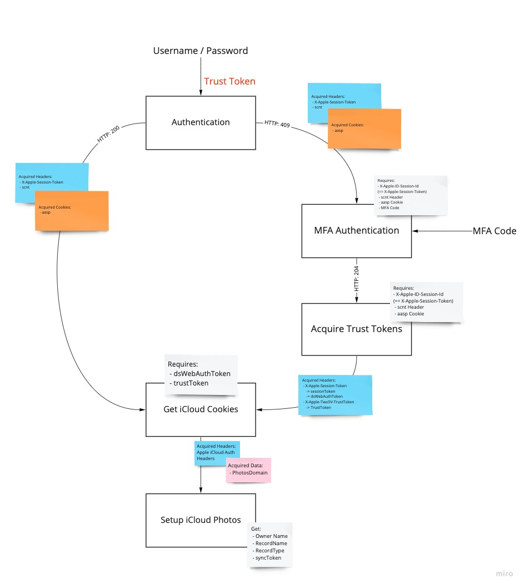

# iCloud API

This is a high level documentation of the reverse engineered iCloud API, used in this application. 

## Postman Collection

In the debugging process, a [Postman Collection](https://github.com/steilerDev/icloud-photos-sync/tree/main/docs/postman) has been created, in order to interact freely with the API.

In order to use it, `username` and `password` variables have to be set in the selected environment. Make sure that the Collection Variables are reset upon changing the environment. Also if you want to reset the current session, reset those variables and restart the authentication process

## Authentication process

This application is using the same authentication flow as icloud.com.

This research concluded in the following flow:

To execute this flow in the provided [Postman Collection](https://github.com/steilerDev/icloud-photos-sync/tree/main/postman), follow these steps:

  1. Run `01-Enter Pwd` Request
  2. If the status code is `409` an MFA code is required, if code is `200` continue to 3.
    1. To resend the MFA code to a trusted device, run `01-- Resend 2FA In-App` request
    2. To resent the MFA code to a phone through a call or sms, run `01-- Resend 2FA Phone` (you may need to adjust the body of this request)
    3. Use the `02-Enter 2FA` to provide a MFA code (by setting the `code` variable in the body), status code `204` expected (since iOS 26.4: status code `409` with `securityCode.valid: true` - see below)
    4. Run `03-Trust Device` Request, expecting 204
  3. Acquire iCloud Cookies through `04-Setup iCloud` request
  4. Setup the Photos Library (and select either the primary or shared library through the environment variable `sharedLibrary`) through `05-Setup iCloud Photos` request
  5. *optionally (and done by the application)* Check, that the Photos Library has finished indexing with `06-Check indexing State`
  6. Now use the `iCloud Photos Library` folder, to execute actions against the iCloud Photos library

### Changes introduced with iOS 26.4

Apple changed the authentication flow of icloud.com with iOS 26.4 (and a second wave in mid 2026). The application implements the following behavior:

  - **MFA code delivery**: The MFA code is no longer pushed to trusted devices automatically after the `409` response of the signin request. It needs to be requested through `PUT /appleauth/auth/verify/trusteddevice/securitycode` (empty body, `202` expected). Phone based codes are still requested through `PUT /appleauth/auth/verify/phone`.
  - **Trusted phone numbers**: Available through `GET /appleauth/auth` (requesting `application/json`), either on top level, nested in `phoneNumberVerification` or nested in the `boot_args` of the HTML response (`direct.twoSV.bridgeInitiateData.phoneNumberVerification`).
  - **Session id**: The backend provides a dedicated `X-Apple-ID-Session-Id` header (in addition to the `X-Apple-Session-Token`), which needs to be echoed in subsequent requests.
  - **MFA code validation**: A valid code is acknowledged with status `409` (instead of `200`/`204`), the response body containing `securityCode.valid: true` and an updated `X-Apple-Session-Token`.
  - **Escrow**: In case a `409` response carries the `X-Apple-EDP` (or `X-Apple-PDP`) header, the backend requires a second SRP based password proof, before trusting the session:
    1. `POST /appleauth/auth/escrow/init` with `{a, accountName: "", protocols: ["s2k", "s2k_fo"]}`
    2. `POST /appleauth/auth/escrow/complete` with `{m1, m2, c, k}`, where `c` is echoed from the init response, `k` is the SRP session key and the proof values are calculated using an empty account name
    
    This happens after a validated MFA code, as well as when signing in with a valid trust token (in which case no MFA code is required - the signin `409` response carries the `X-Apple-EDP` header instead of `X-Apple-TwoSV-Trust-Eligible`).
  - **Account setup**: The `accountLogin` request provides `accountCountryCode`, `extended_login` and `trustToken` in addition to the `dsWebAuthToken`.

The Postman Collection expects the following Environmental variables to be defined:
  - `username` set to the iCloud username
  - `password` set to the iCloud password
  - `sharedLibrary` set to `true` in case the share library should be used