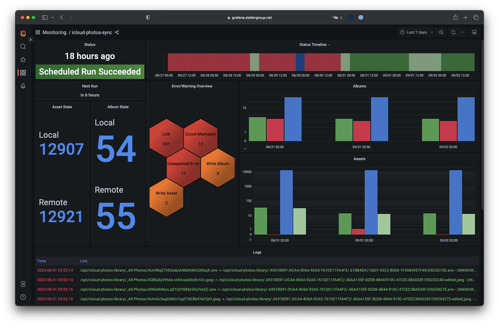

# Sync Metrics Export

This application can export various sync related metrics, which can be used to monitor the sync activities and status. Those metrics are exported to a file, formatted using the [Influx Line Protocol](https://docs.influxdata.com/influxdb/v2.6/reference/syntax/line-protocol/). 

## Usage

Set the `export-metrics` flag, in order to activate the exporter. The file will be written to the root of the data directory and is named `.icloud-photos-sync.metrics`. This file can be consumed using [telegraf's](https://www.influxdata.com/time-series-platform/telegraf/) [tail input plugin](https://github.com/influxdata/telegraf/blob/release-1.25/plugins/inputs/tail/README.md). The following is a sample configuration:

```
[[inputs.tail]]                                                                 
  files = ["/opt/icloud-photos-library/.icloud-photos-sync.metrics"]
  data_format = "influx"
```

## Grafana Dashboard

After importing the metrics into an InfluxDB through telegraf, you can use Grafana to visualize the data. The following example is [available for download](https://github.com/steilerDev/icloud-photos-sync/tree/main/docs/grafana):

[](../assets/grafana-dashboard.png)

## Metrics

All metrics are created using the measurement name `icloud-photos-sync`. 

The following fields will be written:

  - `status`: Provides a string of the current sync progress status. This can include:
    - `AUTHENTICATION_STARTED`
    - `AUTHENTICATED`
    - `MFA_REQUIRED`
    - `MFA_RECEIVED`
    - `DEVICE_TRUSTED`
    - `ACCOUNT_READY`
    - `ICLOUD_READY`
    - `SYNC_START`
    - `FETCH_N_LOAD_STARTED`
    - `FETCH_N_LOAD_COMPLETED`
    - `DIFF_STARTED`
    - `DIFF_COMPLETED`
    - `WRITE_STARTED`
    - `WRITE_ASSETS_STARTED`
    - `WRITE_ASSETS_COMPLETED`
    - `WRITE_ALBUMS_STARTED`
    - `WRITE_ALBUMS_COMPLETED`
    - `WRITE_COMPLETED`
    - `SYNC_COMPLETED`
    - `SYNC_RETRY`
    - `ERROR`
  - `assetsArchived`: The amount of assets archived during an archive operation
  - `remoteAssetsDeleted`: The amount of remote assets deleted during an archive operation (if remote delete is enabled)
  - `localAssetsLoaded`: Gives the amount of local assets loaded during a sync
  - `localAlbumsLoaded`: Gives the amount of local albums loaded during a sync
  - `remoteAssetsFetched`: Gives the amount of remote assets loaded during a sync
  - `remoteAlbumsFetched`: Gives the amount of remote albums loaded during a sync
  - `assetsToBeAdded`: Gives the amount of assets that are meant to be added after diffing the local and remote state
  - `assetsToBeKept`: Gives the amount of assets that are meant to be kept after diffing the local and remote state
  - `assetsToBeDeleted`: Gives the amount of assets that are meant to be deleted after diffing the local and remote state
  - `assetWritten`: The record name of each asset written to disk
  - `albumsToBeAdded`: Gives the amount of albums that are meant to be added after diffing the local and remote state
  - `albumsToBeKept`: Gives the amount of albums that are meant to be kept after diffing the local and remote state
  - `albumsToBeDeleted`: Gives the amount of albums that are meant to be deleted after diffing the local and remote state
  - `errors`: Gives each error message recorded during operation
  - `warnings`: Gives each warning message recorded during operation