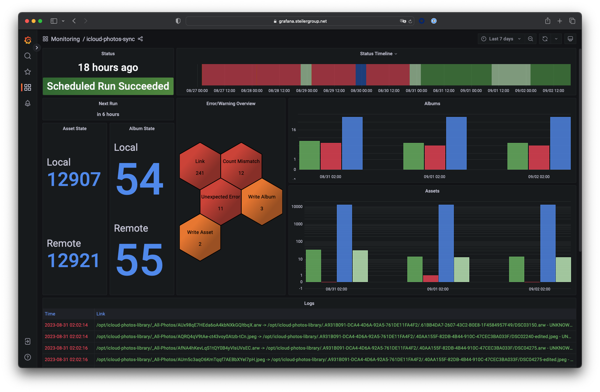

# Sync Metrics Export

This application can export various sync related metrics, which can be used to monitor the sync activities and status. Two independent exporters are available:

  - A file, formatted using the [Influx Line Protocol](https://docs.influxdata.com/influxdb/v2.6/reference/syntax/line-protocol/), containing every status change as an event (described below)
  - A [Prometheus/OpenMetrics endpoint](#prometheus-openmetrics), exposing the current state and aggregated metrics to be scraped

## Usage

Set the [export metrics flag](cli.md#export-metrics), in order to activate the exporter. The file will be written to the root of the data directory and is named `.icloud-photos-sync.metrics`. This file can be consumed using [telegraf's](https://www.influxdata.com/time-series-platform/telegraf/) [tail input plugin](https://github.com/influxdata/telegraf/blob/release-1.25/plugins/inputs/tail/README.md). The following is a sample configuration:

```
[[inputs.tail]]                                                                 
  files = ["/opt/icloud-photos-library/.icloud-photos-sync.metrics"]
  data_format = "influx"
```

## Grafana Dashboard

After importing the metrics into an InfluxDB through telegraf, you can use Grafana to visualize the data. The following example is [available for download](https://github.com/steilerDev/icloud-photos-sync/tree/main/docs/grafana):

[](../assets/grafana-dashboard.png)

When importing the JSON model you need to provide an InfluxDB datasource that supports InfluxQL. [InfluxDB 1.X supports this out of the box](https://docs.influxdata.com/influxdb/v1/query_language/), [InfluxDB 2.X needs to be configured to support InfluxQL](https://docs.influxdata.com/influxdb/v2/query-data/influxql/). 

Additionally you need to specify the measurement name, where the sync metrics are stored. For InfluxDB 1.X this should always be `icloud_photos_sync` (as this is specified in the Influx Line Protocol written by this tool), InfluxDB 2.X however needs to include the [database and retention policy mapping](https://docs.influxdata.com/influxdb/v2/query-data/influxql/#query-a-mapped-bucket-with-influxql) in the measurement query. This could be something like `example-db.example-rp.icloud_photos_sync`, but depends [on the DBRP mapping you previously created](https://docs.influxdata.com/influxdb/v2/query-data/influxql/dbrp/#create-dbrp-mappings).

## Metrics

All metrics are created using the measurement name `icloud_photos_sync`. 

The following fields will be written:

  - `status`: Provides a string of the current sync progress status. This can include:
    - `AUTHENTICATION_STARTED`
    - `AUTHENTICATED`
    - `MFA_REQUIRED`
    - `MFA_RECEIVED`
    - `MFA_NOT_PROVIDED` (if the MFA code was not provided before timeout)
    - `DEVICE_TRUSTED`
    - `SESSION_EXPIRED` (if the current session expired and needs to be refreshed)
    - `ACCOUNT_READY`
    - `ICLOUD_READY`
    - `SYNC_START`
    - `FETCH_N_LOAD_STARTED`
    - `FETCH_N_LOAD_COMPLETED`
    - `DIFF_STARTED`
    - `DIFF_COMPLETED`
    - `WRITE_STARTED`
    - `WRITE_ASSETS_STARTED`
    - `WRITE_ASSETS_COMPLETED`
    - `WRITE_ALBUMS_STARTED`
    - `WRITE_ALBUMS_COMPLETED`
    - `WRITE_COMPLETED`
    - `SYNC_COMPLETED`
    - `SYNC_RETRY`
    - `ERROR`
    - `SCHEDULED` (no previous run)
    - `SCHEDULED_SUCCESS` (last run successful)
    - `SCHEDULED_FAILURE` (error during last run)
  - `status_time`: Provides the time, when the status was last updated
  - Local and remote library state:
    - `local_assets_loaded`: Gives the amount of local assets loaded during a sync
    - `local_albums_loaded`: Gives the amount of local albums loaded during a sync
    - `remote_assets_fetched`: Gives the amount of remote assets loaded during a sync
    - `remote_albums_fetched`: Gives the amount of remote albums loaded during a sync
  - Sync metrics:
    - `assets_to_be_added`: Gives the amount of assets that are meant to be added after diffing the local and remote state
    - `assets_to_be_kept`: Gives the amount of assets that are meant to be kept after diffing the local and remote state
    - `assets_to_be_deleted`: Gives the amount of assets that are meant to be deleted after diffing the local and remote state
    - `asset_written`: The record name of each asset written to disk
    - `albums_to_be_added`: Gives the amount of albums that are meant to be added after diffing the local and remote state
    - `albums_to_be_kept`: Gives the amount of albums that are meant to be kept after diffing the local and remote state
    - `albums_to_be_deleted`: Gives the amount of albums that are meant to be deleted after diffing the local and remote state
  - Daemon metrics:
    - `next_schedule`: Gives the time of the next scheduled execution
  - Archive metrics:
    - `assets_archived`: Gives the amount of assets archived during an archive operation
    - `remote_assets_deleted`: Gives the amount of remote assets deleted during an archive operation
  - `errors`: Gives an error message for each recorded error
  - Warnings (see [common warnings for context](common-warnings.md)), gives an error message for each recorded warning
    - `warn-count_mismatch`
    - `warn-library_load_error`
    - `warn-extraneous_file`
    - `warn-icloud_load_error`
    - `warn-write_asset_error`
    - `warn-write_album_error`
    - `warn-link_error`
    - `warn-filetype_error`
    - `warn-mfa_resend_error`
    - `warn-resource_file_error`
    - `warn-archive_asset_error`

## Prometheus / OpenMetrics

Set the [export Prometheus metrics flag](cli.md#export-prometheus-metrics), in order to expose the `/metrics` endpoint on the web server. The endpoint is served on the [web server port](cli.md#port), below the [web base path](cli.md#web-base-path) (e.g. `http://<host>:80/metrics`). Without the flag, the endpoint does not exist.

The exposition format is negotiated using the `Accept` header, following the [Prometheus content negotiation](https://prometheus.io/docs/instrumenting/content_negotiation/): [OpenMetrics 1.0.0](https://prometheus.io/docs/specs/om/open_metrics_spec/) as well as the [Prometheus text formats](https://prometheus.io/docs/instrumenting/exposition_formats/) 1.0.0 and 0.0.4 are supported, the Prometheus text format 0.0.4 is used as fallback. Prometheus will select OpenMetrics with its default configuration.

The following is a sample scrape configuration:

```yaml
scrape_configs:
  - job_name: icloud-photos-sync
    scrape_interval: 1m
    # Loading a large local library can block the application for a while, delaying the response (see #1006)
    scrape_timeout: 30s
    static_configs:
      - targets: ['icloud-photos-sync:80']
```

The web server is not authenticated, make sure it is only reachable from trusted networks (see [security](security.md)).

### Metrics

All metrics are prefixed with `icps_`. State, error and schedule are read from the application state at scrape time, sync related values reflect the last sync. Metrics without a value (e.g. before the first sync) are omitted. Counters reset upon application restart.

| Metric | Type | Labels | Description |
|---|---|---|---|
| `icps_build_info` | info | `version` | Build information, always `1` |
| `icps_state` | stateset | `icps_state` (`ready`, `running`, `blocked`) | Current application state, `1` for the active state. `blocked` means the application is waiting for the MFA code |
| `icps_last_run_error` | gauge | | `1` if the last run (sync or re-authentication) ended with an error, cleared when the next run starts |
| `icps_next_sync_timestamp_seconds` | gauge | | Time of the next scheduled sync |
| `icps_last_sync_success_timestamp_seconds` | gauge | | Time of the last successful sync |
| `icps_sync_phase_duration_seconds` | gauge | `phase` (`authentication`, `fetchAndLoad`, `diff`, `writeAssets`, `writeAlbums`) | Duration of the last completed run of each sync phase. Authentication includes the time waiting for the MFA code |
| `icps_loaded_local_assets`, `icps_loaded_local_albums` | gauge | | Number of assets/albums loaded from the local library during the last sync |
| `icps_loaded_remote_assets`, `icps_loaded_remote_albums` | gauge | | Number of assets/albums fetched from iCloud during the last sync |
| `icps_assets_to_be_added`, `icps_assets_to_be_deleted`, `icps_assets_to_be_kept` | gauge | | Number of assets to be added, deleted or kept after diffing the local and remote state during the last sync |
| `icps_albums_to_be_added`, `icps_albums_to_be_deleted`, `icps_albums_to_be_kept` | gauge | | Number of albums to be added, deleted or kept after diffing the local and remote state during the last sync |
| `icps_sync_runs_total` | counter | `result` (`success`, `failure`) | Number of finished sync runs |
| `icps_sync_retries_total` | counter | | Number of sync attempts that failed and were retried |
| `icps_assets_written_total` | counter | | Number of assets written to the local library |
| `icps_warnings_total` | counter | `type` | Number of runtime warnings by type (see [common warnings](common-warnings.md)) |

When serving OpenMetrics, counters also carry a `_created` sample. Prometheus stores those as separate series, unless the `created-timestamp-zero-ingestion` feature flag is enabled.

### Sample Alerts

```yaml
groups:
  - name: icloud-photos-sync
    rules:
      - alert: ICPSSyncStale
        expr: time() - icps_last_sync_success_timestamp_seconds > 2 * 24 * 3600
        annotations:
          summary: No successful sync within the last two days
      - alert: ICPSWaitingForMFA
        expr: icps_state{icps_state="blocked"} == 1
        for: 5m
        annotations:
          summary: Waiting for the MFA code, use the web UI to provide it
      - alert: ICPSLastRunFailed
        expr: icps_last_run_error == 1
        annotations:
          summary: The last run ended with an error, check the web UI for details
```